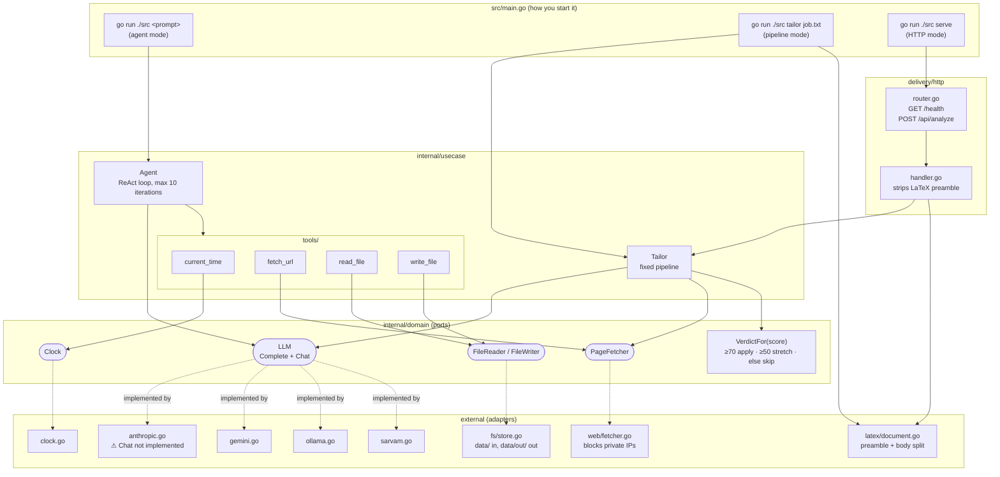
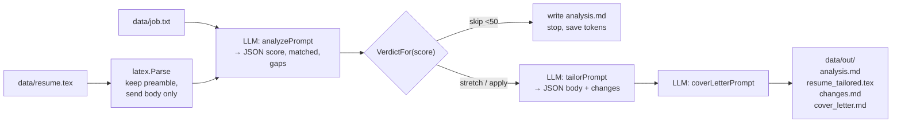
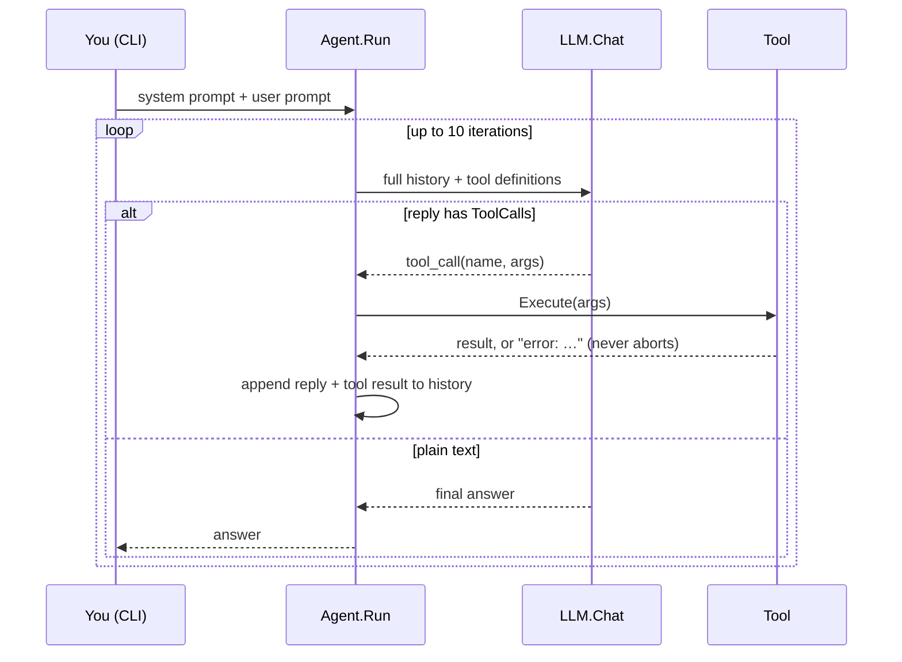
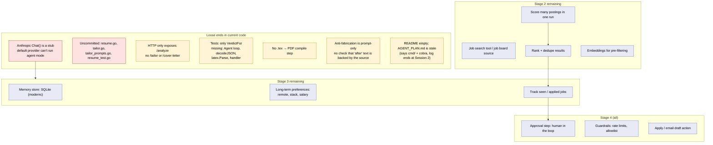
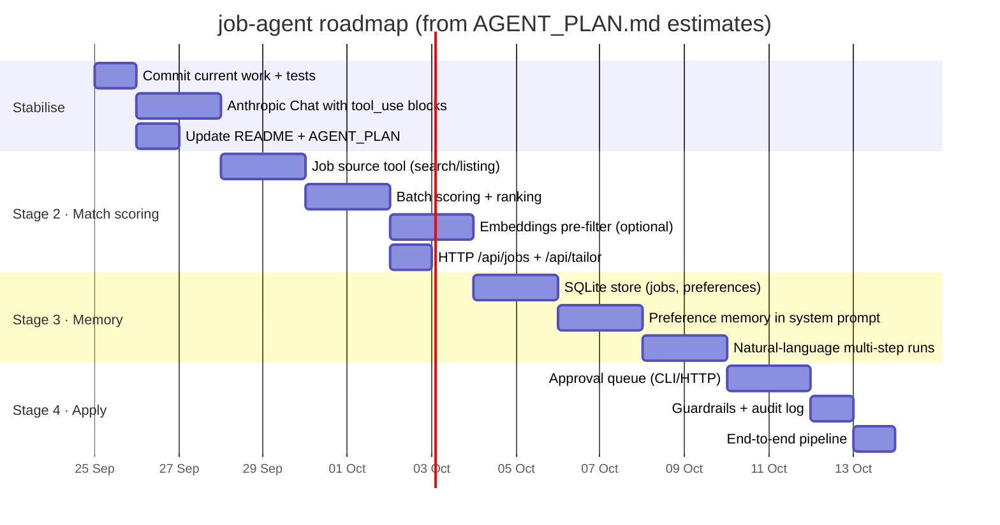
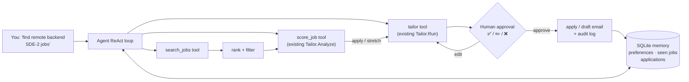

# job-agent — Project Status

> Snapshot as of 2026-09-24. Based on `AGENT_PLAN.md`, the code in `src/`, and uncommitted work.

## Planned vs. delivered

| Stage (from AGENT_PLAN.md) | Status | Evidence |
|---|---|---|
| **1. Resume tailoring** | ✅ Done (some edits not committed yet) | `Tailor` pipeline: analyse → verdict gate → tailored `.tex` → changes log → cover letter |
| **2. Job match scoring** | 🟡 Partly done | `fetch_url` tool, SSRF-safe fetcher and `POST /api/analyze` score **one** URL. There's no job search, ranking or embeddings. |
| **3. Agent with memory** | 🟡 Loop done, no memory | The ReAct `Agent` loop was built early, in Stage 1. There's no memory store or SQLite. |
| **4. Semi-automated apply** | ⬜ Not started | — |
| Extras you didn't plan | ✅ | 4 LLM adapters (Anthropic, Gemini, Ollama, Sarvam), clean-architecture ports, Gin HTTP server, justfile |

---

## 1. How it works now

### Architecture

### Tailor pipeline (`just run tailor job.txt`)

### Agent loop (`just run "your prompt"`)

---

## 2. What's pending

**Most important gap:** `LLM_PROVIDER` defaults to `anthropic`, but [anthropic.go:57](../src/external/llm/anthropic.go#L57) returns "Chat not implemented". With the default provider, only `tailor` and `serve` work. Agent mode only runs on Gemini, Ollama or Sarvam.

---

## 3. Future plan

### Roadmap

### Target architecture after Stage 4

**Design note for Stage 3:** `Tailor` is a fixed pipeline, and `Agent` is the loop that makes decisions. The easy path is to wrap `Tailor.Analyze` and `Tailor.Run` as **tools**. The agent then chooses *which* jobs to process, and the pipeline keeps doing each job the same way every time. The verdict gate from Stage 1 carries over unchanged.

## Next step

1. Commit the current changes (verdict derivation + `resume_test.go`).
2. Implement Anthropic `Chat()`: translate `domain.Message`/`ToolCall` to Anthropic's typed `tool_use`/`tool_result` content blocks, so the default provider can run agent mode.
